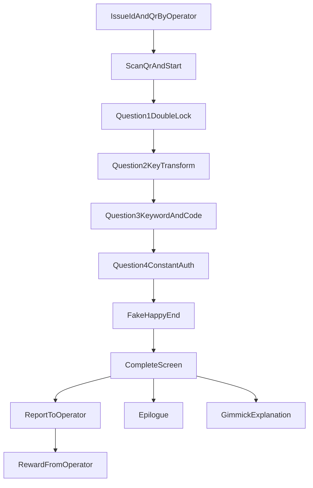

# PRD: いちょう祭ストーリー進行型謎解きゲーム

author: nagomu  
status: draft-v1  
updatedAt: 2026.04.20  
reviewer: [塩見文梨](mailto:shiomi.ayari@gmail.com) / [いたこす](mailto:ita.kosu55@gmail.com) / [針猫（ゆにねこ）](mailto:harineko0927@gmail.com)

---

## 1. 背景

- 阪大いちょう祭の来場者向けに、4問構成のストーリー進行型謎解き体験を提供する。
- 体験の軸は「AIイリスを修復しながら真相に迫る」導線で、最後にどんでん返しのエピローグへ接続する。
- 運営は当日オペレーションで回せること、来場者はスマホで迷わず進めることを重視する。

## 2. 目的と成功指標

### 2.1 目的

1. 来場者がストーリー没入感を保ったまま4問を完走できる体験を作る。
2. 運営が配布・進捗確認・景品受け渡しを少人数で安定運用できるようにする。
3. 問題が詰まった際にAIチャットで補助し、離脱を減らす。

### 2.2 KPI（当日評価）

- 体験開始数（QR読み取り数）
- Q1/Q2/Q3/Q4の到達率
- 完走率（complete画面到達率）
- 平均所要時間（開始からcompleteまで）
- ヒント利用率（AIチャット利用セッション比率）

## 3. スコープ

### 3.1 対象（In Scope）

- 来場者向けWebアプリ（1グループ1端末想定）
- 運営向けID発行、QR生成、進捗確認機能
- 4問進行、偽エンド、運営報告、エピローグ、complete表示
- AIチャットによるヒント提供（ネタバレ制御あり）
- 進捗ログ、回答試行ログ、ヒント利用ログ

### 3.2 対象外（Out of Scope）

- ユーザー自己登録、SNS連携などのアカウント機能
- ネイティブアプリ（iOS/Android個別実装）
- 祭終了後の常設運用を前提とした大規模分析基盤

## 4. ステークホルダー・ユーザー

- 運営: GDGoC Osaka システム運用メンバー
- 来場者: いちょう祭で謎解きに参加する個人またはグループ
- 監修/レビュー: ストーリー、問題、体験品質を確認するメンバー

## 5. 体験フロー（E2E）

1. 運営が来場者グループにID付きQR社員証を配布
2. 来場者がQRを読み取り、開始画面からQ1へ進む
3. Q1〜Q4を順番に解いて進行
4. Q4後に偽ハッピーエンドを表示
5. エンド表示後complete画面を表示
6. complete画面は, 報告ページを開くリンク, エピローグを表示するリンク, ギミック開設をするリンクを持つ

## 6. 機能要件（来場者向け）

### 6.1 共通要件

- ログイン不要。QRリンクに含まれるIDでセッションを識別する。
- 問題は順序ロックされ、未解放問題URLに直接アクセスしても遷移できない。
- 途中離脱後に同一IDで再アクセスした際、前回進捗から再開できる。
- 正解時は進捗ログを記録し、次の問題を解放する。
- 不正解時は回数を記録し、問題文再表示とヒント導線を提示する。

### 6.2 設問1（ギミック①: 二重ロック解除）

#### 6.2.1 仕様

- 1-1: 連立方程式を解いておおよその位置を特定する。
- 1-2: パズル問題を解いておおよその位置を特定する。
- 1-1/1-2の両方クリアでQ1クリアとみなす。
- 各設問はARダウジングで詳細位置を特定し、対応NFCタッチで完了する。
- 1-1/1-2の音源は別周波数（可聴域以上）を使い、受信側で帯域分離して混線を防ぐ。

#### 6.2.2 受け入れ条件（Given/When/Then）

- Given Q1開始状態, When 1-1のみ完了, Then Q1は未クリアのままで1-2を要求する。  
- Given 1-1と1-2が完了, When 判定処理が走る, Then Q2が解放される。  
- Given NFC未タッチ, When 回答のみ送信, Then 設問完了にならない。  
- Given Q1完了, When 完了演出を表示, Then 「NFC機能解放」メッセージを表示する。

### 6.3 設問2（ギミック②: 変換機）

#### 6.3.1 仕様

- かな→英数入力変換の解法で解答文字列を導く。
- 解答入力が正解の場合、次のNFC位置情報を表示する。
- 指定NFCタッチでQ2完了とし、Q3を解放する。
- AIチャットは詰まり時に段階ヒントを提示する。

#### 6.3.2 受け入れ条件

- Given Q2開始状態, When 正しい変換結果を入力, Then NFC位置案内を表示する。  
- Given NFC位置案内表示中, When 指定NFCをタッチ, Then Q3を解放する。  
- Given 不正解入力, When 送信, Then 不正解として試行ログを記録する。

### 6.4 設問3（ギミック③: 室内探索と数値コード）

#### 6.4.1 仕様

- 室内探索で得たキーワード入力で中間進行。
- パズル結果「掃き溜めに鶴」から、指定位置（ゴミ箱付近）の情報へ誘導する。
- 最終的に `sqrt(5)` の有効数字3桁コードを入力させる。
- 正解で「上級権限解放」を表示しQ4へ進める。

#### 6.4.2 受け入れ条件

- Given Q3開始状態, When キーワード正解, Then 数値コード入力ステップへ遷移する。  
- Given 数値コード入力ステップ, When `sqrt(5)` 有効数字3桁が一致, Then Q4を解放する。  
- Given フォーマット違反入力, When 送信, Then 桁数エラーを表示する。

### 6.5 設問4（ギミック④: 定数認証）

#### 6.5.1 仕様

- 英字→数字変換で得られる最終値を入力する。
- 正解時にイリスの祝福テキストを表示し、偽ハッピーエンドへ遷移する。
- 偽エンド終了後, complete画面を表示する。

#### 6.5.2 受け入れ条件

- Given Q4開始状態, When 最終値を正しく入力, Then 偽ハッピーエンドを表示する。  
- Given 偽ハッピーエンド表示中, When 次に進む操作, Then complete画面を表示する。

### 6.6 エンディング体験

- エピローグには倒産の真相、数式の真意、結末を含める。
- エピローグ閲覧完了後、complete画面に戻ることができる
- complete画面には以下を表示する。  
  - エピローグ
  - 謎ギミック解説（技術説明含む）
  - ストーリーの全体像（エピローグを含む）

## 7. 機能要件（AIチャット）

- チャットキャラクターは「イリス」として振る舞う。
- ヒントは段階制（軽い誘導 -> 中ヒント -> 強ヒント）にする。
- 直接答えを返さない制御を設ける。
- 現在の問題ステータスを参照し、未解放問題のヒントは返さない。
- すべてのチャット要求/応答を `hint_logs` として保存する。

## 8. 機能要件（運営向け）

### 8.1 ID発行・QR配布

- 運営は来場者グループ単位で一意IDを発行できる。
- 各IDに対し開始URLを含むQRを生成し、社員証として印刷または表示できる。
- IDは推測困難なランダム文字列を採用する。

### 8.2 進捗ダッシュボード

- 各IDの現在ステータス（開始前/Q1/Q2/Q3/Q4/偽エンド/報告済/完了）を一覧表示する。
- 最終更新時刻、試行回数、ヒント利用回数を確認できる。
- 運営が手動でステータスを補正できる救済操作を提供する（監査ログ必須）。

### 8.3 景品受け渡し・報告処理

- 偽エンド到達画面の提示を受け、運営が報告済みフラグを付与する。
- 報告済み付与後のみ、来場者端末でエピローグを閲覧できる。

## 9. データ要件

### 9.1 テーブル責務（論理）

- `users`  
  - 来場者グループID、発行情報、端末再開用の基本属性
- `user_progress_logs`  
  - 問題解放/完了、エンド進行状態、運営報告フラグ
- `attempt_logs`  
  - 問題ごとの入力値（マスク可）、正誤、試行時刻
- `hint_logs`  
  - チャット問い合わせ、返答レベル、対象問題
- `operator_actions`  
  - 運営の手動補正、報告済み付与、景品対応メモ

### 9.2 保持すべき状態

- 現在問題番号、各問題の完了有無
- NFC到達確認、解答試行回数
- 偽エンド表示済み、運営報告済み、エピローグ閲覧完了
- 監査用タイムスタンプ（作成・更新・操作）

## 10. 非機能要件

### 10.1 可用性・性能

- 祭開催時間帯の継続利用を前提に、想定同時接続を捌ける構成にする。
- 主要画面の表示はモバイル回線下で実用的な待機時間に収める。
- 障害時に最低限「進捗確認」と「手動進行」が可能な運営手段を用意する。

### 10.2 セキュリティ

- ID直打ち推測を困難にするため、十分長いランダム値を使用する。
- 不正なステータス更新API呼び出しを防ぐ検証を実装する。
- 管理画面には運営専用認証を設ける。

### 10.3 端末・ブラウザ制約

- 来場者端末はモバイルブラウザを基本とする。
- NFC非対応端末向けに運営救済フロー（手動進行）を用意する。
- 画面は縦持ちスマホを基準に設計する。

## 11. 当日運用要件

1. 開始前にID/QRを事前生成し配布順に管理する。  
2. スタッフは進捗ダッシュボードで滞留グループを検知し声掛けする。  
3. 詰まり時はAIチャット誘導、必要時は運営手動救済を行う。  
4. 偽エンド到達者には景品受け渡し後、報告済み処理を行う。  
5. 終了後にログを回収し、次回改善の分析に利用する。

## 12. 表示テキスト仕様（抜粋）

- Q1前: 「現在アプリのすべての機能がロックされています。二重ロックを解除してください。」  
- Q1後: 「二重ロック解除完了。NFC機能が解放されました。」  
- Q3後: 「上級権限解放。イリスとしての権限は最大値です！」  
- Q4後: 「29は最強のラッキーナンバーなんですよ！おめでとうございます」  
- 報告時: 「エピローグまで含めて物語になっているので是非最後まで読んでみてくださいね」

## 13. Open Issues（優先度付き）

### High

1. 各設問の最終正答値と判定許容範囲（表記ゆれ、全角半角）の確定  
2. NFCタグ配置場所と当日導線の最終確定  
3. NFC非対応端末の救済手順（運営UI操作・本人確認）の確定  
4. AIチャットのネタバレ閾値（どこまで許可するか）の合意

### Medium

1. Q1音源の周波数設計と端末個体差に対する検証計画  
2. 偽エンドから報告導線のUI文言と誤離脱防止デザイン  
3. complete画面に掲載する技術解説の粒度

### Low

1. ログ保持期間と匿名化ポリシー  
2. 祭終了後のアーカイブ公開範囲（学内/外部）