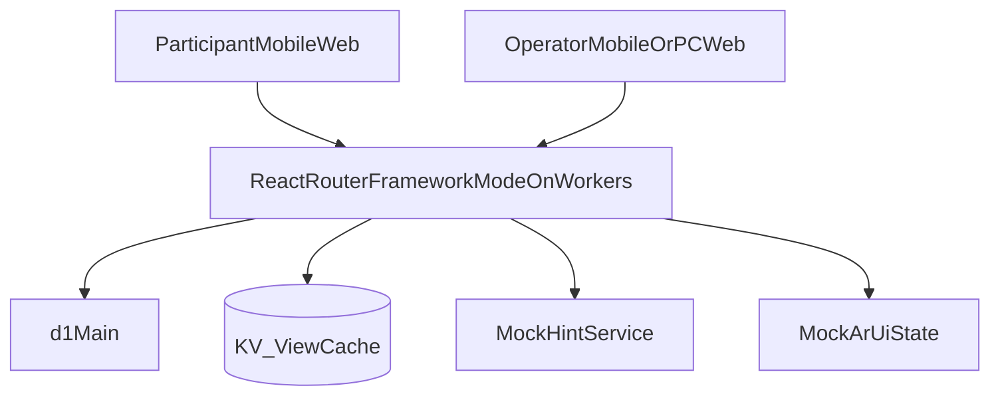

# 技術仕様書: いちょう祭ストーリー進行型謎解きゲーム

author: nagomu  
status: draft  
updatedAt: 2026.04.22

---

## 1. 目的と前提

本書は `specs.md` を実装可能な技術仕様に落とし込むための設計書である。  
対象はモバイルブラウザ中心の来場者体験と、当日運営のオペレーション機能。

採用前提:
- ランタイム: Cloudflare Workers
- Webフレームワーク: React Router Framework Mode
- 言語: TypeScript
- データ基盤: Cloudflare D1（正データ） + Cloudflare KV（表示最適化キャッシュ）
- AIチャット: 初期はモック（定型ヒント）
- ARダウジング: 初期はモックUI
- 運営認証: salt + PBKDF2反復ハッシュ

---

## 2. システムアーキテクチャ

### 2.1 全体構成



責務:
- React Router:
  - 画面ルーティング（参加者導線/運営導線）
  - `loader` でデータ取得、`action` で状態更新
- Workers:
  - 入力正規化、正答判定、状態遷移検証
  - 認証・セッション発行
- D1:
  - 進捗と監査の唯一の正データソース
  - `state_version` による楽観ロックとトランザクションで更新競合を制御
  - `idempotency_keys` による重複リクエストの抑止
- KV:
  - ダッシュボード等の参照高速化キャッシュ
  - 正答判定や状態遷移の根拠には使わない

### 2.2 設計原則

- すべての進行判定はサーバ側で行う。
- URL直アクセス防止は「画面表示制御」ではなく「サーバ状態遷移検証」で担保する。
- Q1順序は初回開始時に確定し、再開時も同一順序を必ず使用する。
- 同一 `groupId` の更新系APIは D1 トランザクション + `state_version` 条件付き更新で整合性を担保する。
- 進捗の正データはD1のみ。KVは再構築可能な派生状態として扱う。
- KVミス時は必ずD1フォールバックする。
- 実装は3層クリーンアーキテクチャを採用し、依存方向を内側（Domain/Application）へ固定する。

### 2.3 主要データフロー

1. 参加者が開始URLへアクセス。`users` レコード作成または再開。  
2. `groupId` を伴う更新系API（参加者回答・checkpoint・運営手動補正・報告済み更新）はWorkersで `X-Idempotency-Key` を検証。重複なら前回結果を返却。  
3. Workersが状態遷移を検証し、D1トランザクションで `users` 更新と監査ログ書き込みを同時に実行（`users.state_version` をインクリメント）。  
4. 運営手動補正も同様にD1へ `state_version` 条件付きで反映し、`operator_actions` を記録。  
5. 更新失敗（競合）時は `409 CONFLICT_STATE` を返し、クライアントは最新進捗再取得後に再送する。  
6. 進捗変更時、`dash:version:v1` をインクリメントしてダッシュボードキャッシュを世代更新。  
7. 運営ダッシュボード参照時、KV（世代付きキー）→D1フォールバック→KV再構築。

### 2.4 D1 / KV の採用方針

- D1（正データ）:
  - 永続化が必要なすべての業務データ（進捗、監査、回答ログ、運営操作ログ）
  - 運営セッション正データ（`operator_sessions`）とセッション監査イベントの保持
  - 障害復旧時の再計算・監査証跡の起点
  - 更新競合は `state_version` 楽観ロック + `idempotency_keys` で吸収
- KV（参照最適化 + セッションキャッシュ）:
  - ダッシュボード向け短TTLキャッシュと固定設定値
  - 運営セッションの読み取りキャッシュ（正データはD1）
  - ダッシュボードは世代管理キーで論理無効化する
  
補足（将来拡張）:
- 同時接続増加や競合率上昇で必要になった場合のみ、更新系APIにDurable Objectsを追加する。

### 2.5 3層クリーンアーキテクチャ

レイヤ構成:
- Presentation層（Route/Controller）:
  - React Routerの`loader`/`action`でHTTP入出力、認証チェック、DTO変換を担当
  - UseCase呼び出し以外の業務ロジックを持たない
- Application層（UseCase）:
  - 状態遷移、冪等制御、権限判定、トランザクション境界を担当
  - `SessionRepository` や `ProgressRepository` などの抽象インターフェースに依存
- Infrastructure層（Repository/External）:
  - D1/KV/モックHintサービスへのアクセス実装を担当
  - Drizzle ORMとCloudflare Bindingはこの層に閉じ込める

依存ルール:
- 実行フローは `Presentation -> Application -> Infrastructure` とする
- 依存方向は `Presentation -> Application <- Infrastructure` を維持する（Applicationが中心）
- Application層はCloudflare固有APIへ直接依存しない
- Domainルール（状態遷移、回答正規化）はApplication層内の純粋関数として実装しテスト可能に保つ

---

## 3. 画面/ルーティング仕様（React Router）

### 3.1 参加者ルート

- `GET /start/:groupId`
  - セッション開始・再開
  - Q1順序が未設定なら割当実行
- `GET /q1/1-1`
- `GET /q1/1-2`
- `POST /q1/:subQuestion/answer`
- `POST /q1/:subQuestion/checkpoint`（NFC/QR到達確定）
- `GET /q2`
- `POST /q2/answer`
- `POST /q2/checkpoint`
- `GET /q3`
- `POST /q3/keyword`
- `POST /q3/code`
- `GET /q4`
- `POST /q4/answer`
- `GET /fake-end`
- `GET /complete`
- `POST /complete/epilogue-viewed`

### 3.2 運営ルート

- `GET /operator/login`
- `POST /operator/login`
- `POST /operator/logout`
- `GET /operator/dashboard`
- `GET /operator/group/:groupId`
- `POST /operator/group/:groupId/status-correction`
- `POST /operator/group/:groupId/mark-reported`

### 3.3 ルートガード

- 参加者導線:
  - すべて `groupId` 単位で現在ステータスを検証
  - 未解放ページは `409 CONFLICT_STATE` を返す
- 運営導線:
  - セッションCookie必須
  - 未認証時は `401` またはログイン画面へリダイレクト

---

## 4. API入出力定義

共通ヘッダー:
- `Content-Type: application/json`
- `X-Request-Id`（クライアント送信可。未指定ならサーバ生成）
- `X-Idempotency-Key`（`groupId` を伴う更新系APIで必須。30日間は同一キー再利用禁止）

共通エラーレスポンス:
```json
{
  "error": {
    "code": "CONFLICT_STATE",
    "message": "Current progress does not allow this operation.",
    "requestId": "req_xxx"
  }
}
```

エラーコード:
- `BAD_REQUEST`
- `UNAUTHORIZED`
- `FORBIDDEN`
- `NOT_FOUND`
- `CONFLICT_STATE`
- `INTERNAL_ERROR`

認証系エラー運用:
- セッション未提示・期限切れ・失効は `UNAUTHORIZED`（HTTP 401）
- 認証済みだが許可されない操作は `FORBIDDEN`（HTTP 403）

### 4.1 開始/再開

`GET /api/v1/session/start/:groupId`

レスポンス:
```json
{
  "groupId": "g_xxxx",
  "currentStage": "Q1",
  "q1Order": "Q1_1_FIRST",
  "currentUnlockedSubQuestion": "Q1_1",
  "resumeTokenIssued": true
}
```

処理:
- 初回アクセス: `q1Order` をサーバでランダム確定
- 再開アクセス: 既存 `q1Order` を返却（再抽選しない）

### 4.2 Q1回答送信

`POST /api/v1/q1/:subQuestion/answer`

リクエスト:
```json
{
  "answerRaw": "  029 ",
  "clientTs": "2026-04-21T11:25:10.120Z"
}
```

レスポンス:
```json
{
  "subQuestion": "Q1_1",
  "isCorrect": true,
  "normalizedAnswer": "29",
  "nextAction": "REQUIRE_CHECKPOINT"
}
```

バリデーション:
- `subQuestion`: `Q1_1` or `Q1_2`
- 現在解放中サブ設問と一致しない場合 `CONFLICT_STATE`
- 同一 `X-Idempotency-Key` 再送時は、前回レスポンスをそのまま返却

### 4.3 Q1チェックポイント確定（NFC/QR）

`POST /api/v1/q1/:subQuestion/checkpoint`

リクエスト:
```json
{
  "method": "NFC",
  "checkpointCode": "cp_q1_1_a"
}
```

レスポンス:
```json
{
  "subQuestion": "Q1_1",
  "checkpointCompleted": true,
  "q1OverallCompleted": false,
  "currentUnlockedSubQuestion": "Q1_2",
  "nextStage": "Q1"
}
```

補足:
- `method`: `NFC` or `FALLBACK_QR`
- 2つ目サブ設問まで完了した時点で `nextStage: Q2`

### 4.4 Q2/Q3/Q4回答系（共通）

`POST /api/v1/:stage/answer`（`stage` は `q2|q3|q4`）

レスポンス共通:
```json
{
  "stage": "Q2",
  "isCorrect": true,
  "nextStage": "Q3",
  "requiresCheckpoint": true
}
```

Q3は2段階:
- `POST /api/v1/q3/keyword`
- `POST /api/v1/q3/code`

### 4.5 参加者進捗取得

`GET /api/v1/progress`

レスポンス:
```json
{
  "groupId": "g_xxxx",
  "currentStage": "Q3_CODE",
  "q1Order": "Q1_2_FIRST",
  "completed": {
    "q1_1": true,
    "q1_2": true,
    "q2": true,
    "q3Keyword": true,
    "q3Code": false,
    "q4": false
  }
}
```

### 4.6 運営ログイン

`POST /api/v1/operator/login`

リクエスト:
```json
{
  "password": "plain_text_input"
}
```

レスポンス:
```json
{
  "authenticated": true
}
```

補足:
- 単一運営アカウント方式（`operator_id` は固定値 `operator`）とする
- サーバでPBKDF2ハッシュ比較
- 成功時 `operator_session` Cookie発行
- D1 `operator_sessions` に必ずINSERTし、KVへはキャッシュとして保存
- D1 `operator_session_events` に `LOGIN_SUCCESS` を記録

### 4.7 運営ダッシュボード一覧

`GET /api/v1/operator/dashboard?cursor=...&limit=50`

レスポンス:
```json
{
  "items": [
    {
      "groupId": "g_xxxx",
      "currentStage": "Q2",
      "attemptCountTotal": 7,
      "hintCountTotal": 2,
      "updatedAt": "2026-04-21T11:30:00.000Z"
    }
  ],
  "nextCursor": "..."
}
```

### 4.8 運営ステータス補正

`POST /api/v1/operator/group/:groupId/status-correction`

リクエスト:
```json
{
  "fromStage": "Q2",
  "toStage": "Q3",
  "reasonCode": "OP_RESCUE",
  "note": "NFC端末不調のため手動補正"
}
```

レスポンス:
```json
{
  "updated": true,
  "currentStage": "Q3"
}
```

### 4.9 更新系APIの整合性ルール

以下はすべて、Workersでの遷移検証後にD1トランザクションで更新する。

- `POST /api/v1/q1/:subQuestion/answer`
- `POST /api/v1/q1/:subQuestion/checkpoint`
- `POST /api/v1/q2/answer`
- `POST /api/v1/q2/checkpoint`
- `POST /api/v1/q3/keyword`
- `POST /api/v1/q3/code`
- `POST /api/v1/q4/answer`
- `POST /api/v1/complete/epilogue-viewed`
- `POST /api/v1/operator/group/:groupId/status-correction`
- `POST /api/v1/operator/group/:groupId/mark-reported`

補足:
- 上記更新系APIは `X-Idempotency-Key` 必須。
- `idempotency_keys` で同一キー重複を判定し、重複時は初回レスポンスを返却。
- 同一キー同時到着の競合で `409 CONFLICT_STATE` が発生する場合を許容し、クライアントは進捗再取得後に同一操作を再送する。
- D1反映後に `dash:version:v1` をインクリメントし、世代切替でキャッシュを論理無効化する。
- `POST /api/v1/operator/group/:groupId/status-correction` と `POST /api/v1/operator/group/:groupId/mark-reported` も `X-Idempotency-Key` 必須で、WorkersからD1へ `state_version` 条件付き更新を行う。
- `POST /api/v1/operator/login` と `POST /api/v1/operator/logout` は `groupId` を持たないため本ルールの対象外。

### 4.10 運営ログアウト

`POST /api/v1/operator/logout`

レスポンス:
```json
{
  "loggedOut": true
}
```

処理:
- D1 `operator_sessions.revoked_at` を更新し、正データを先に失効させる。
- `op:session:cache:v1:{sessionId}` を削除（失敗時は短時間リトライ後に継続）。
- D1 `operator_session_events` に `LOGOUT` を記録。

---

## 5. D1データベース設計

### 5.1 テーブル一覧

- `users`
- `user_progress_logs`
- `attempt_logs`
- `hint_logs`
- `operator_actions`
- `operator_credentials`
- `operator_sessions`
- `operator_session_events`
- `idempotency_keys`

### 5.2 進捗状態モデル

- `users.current_stage`
  - `START | Q1 | Q2 | Q3_KEYWORD | Q3_CODE | Q4 | FAKE_END | COMPLETE`
- `users.q1_order`
  - `Q1_1_FIRST | Q1_2_FIRST`
- `users.current_unlocked_subquestion`
  - `Q1_1 | Q1_2 | NULL`
- `users.state_version`
  - 更新ごとに +1 する単調増加バージョン

### 5.3 DDL

```sql
CREATE TABLE IF NOT EXISTS users (
  group_id TEXT PRIMARY KEY,
  current_stage TEXT NOT NULL DEFAULT 'START',
  state_version INTEGER NOT NULL DEFAULT 0,
  q1_order TEXT,
  current_unlocked_subquestion TEXT,
  q1_1_answer_correct INTEGER NOT NULL DEFAULT 0,
  q1_1_checkpoint_done INTEGER NOT NULL DEFAULT 0,
  q1_2_answer_correct INTEGER NOT NULL DEFAULT 0,
  q1_2_checkpoint_done INTEGER NOT NULL DEFAULT 0,
  q2_answer_correct INTEGER NOT NULL DEFAULT 0,
  q2_checkpoint_done INTEGER NOT NULL DEFAULT 0,
  q3_keyword_correct INTEGER NOT NULL DEFAULT 0,
  q3_code_correct INTEGER NOT NULL DEFAULT 0,
  q4_answer_correct INTEGER NOT NULL DEFAULT 0,
  fake_end_shown INTEGER NOT NULL DEFAULT 0,
  reported INTEGER NOT NULL DEFAULT 0,
  epilogue_viewed INTEGER NOT NULL DEFAULT 0,
  started_at TEXT,
  completed_at TEXT,
  reported_at TEXT,
  epilogue_viewed_at TEXT,
  created_at TEXT NOT NULL,
  updated_at TEXT NOT NULL,
  CHECK (q1_order IN ('Q1_1_FIRST', 'Q1_2_FIRST') OR q1_order IS NULL),
  CHECK (current_unlocked_subquestion IN ('Q1_1', 'Q1_2') OR current_unlocked_subquestion IS NULL)
);

CREATE TABLE IF NOT EXISTS user_progress_logs (
  id INTEGER PRIMARY KEY AUTOINCREMENT,
  group_id TEXT NOT NULL,
  event_type TEXT NOT NULL,
  from_stage TEXT,
  to_stage TEXT,
  metadata_json TEXT,
  created_at TEXT NOT NULL,
  FOREIGN KEY(group_id) REFERENCES users(group_id)
);

CREATE TABLE IF NOT EXISTS attempt_logs (
  id INTEGER PRIMARY KEY AUTOINCREMENT,
  group_id TEXT NOT NULL,
  stage TEXT NOT NULL,
  input_raw TEXT,
  input_normalized TEXT,
  is_correct INTEGER NOT NULL,
  created_at TEXT NOT NULL,
  FOREIGN KEY(group_id) REFERENCES users(group_id)
);

CREATE TABLE IF NOT EXISTS hint_logs (
  id INTEGER PRIMARY KEY AUTOINCREMENT,
  group_id TEXT NOT NULL,
  stage TEXT NOT NULL,
  hint_level INTEGER NOT NULL,
  user_message TEXT NOT NULL,
  assistant_message TEXT NOT NULL,
  created_at TEXT NOT NULL,
  FOREIGN KEY(group_id) REFERENCES users(group_id)
);

CREATE TABLE IF NOT EXISTS operator_actions (
  id INTEGER PRIMARY KEY AUTOINCREMENT,
  operator_id TEXT NOT NULL,
  group_id TEXT NOT NULL,
  action_type TEXT NOT NULL,
  reason_code TEXT,
  before_state_json TEXT,
  after_state_json TEXT,
  note TEXT,
  created_at TEXT NOT NULL,
  FOREIGN KEY(group_id) REFERENCES users(group_id)
);

CREATE TABLE IF NOT EXISTS operator_credentials (
  operator_id TEXT PRIMARY KEY,
  password_hash_b64 TEXT NOT NULL,
  salt_b64 TEXT NOT NULL,
  iterations INTEGER NOT NULL,
  hash_algo TEXT NOT NULL DEFAULT 'PBKDF2-SHA256',
  created_at TEXT NOT NULL,
  updated_at TEXT NOT NULL
);

CREATE TABLE IF NOT EXISTS operator_sessions (
  session_id TEXT PRIMARY KEY,
  operator_id TEXT NOT NULL,
  expires_at TEXT NOT NULL,
  revoked_at TEXT,
  created_at TEXT NOT NULL
);

CREATE TABLE IF NOT EXISTS operator_session_events (
  id INTEGER PRIMARY KEY AUTOINCREMENT,
  session_id TEXT NOT NULL,
  operator_id TEXT NOT NULL,
  event_type TEXT NOT NULL, -- LOGIN_SUCCESS | LOGOUT | REVOKED | EXPIRED | CACHE_MISS
  metadata_json TEXT,
  created_at TEXT NOT NULL
);

CREATE TABLE IF NOT EXISTS idempotency_keys (
  idempotency_key TEXT NOT NULL,
  group_id TEXT NOT NULL,
  api_name TEXT NOT NULL,
  response_json TEXT NOT NULL,
  status_code INTEGER NOT NULL,
  created_at TEXT NOT NULL,
  expires_at TEXT NOT NULL,
  PRIMARY KEY (group_id, api_name, idempotency_key),
  FOREIGN KEY(group_id) REFERENCES users(group_id)
);

CREATE INDEX IF NOT EXISTS idx_users_current_stage ON users(current_stage);
CREATE INDEX IF NOT EXISTS idx_users_updated_at ON users(updated_at);
CREATE INDEX IF NOT EXISTS idx_progress_group_created ON user_progress_logs(group_id, created_at DESC);
CREATE INDEX IF NOT EXISTS idx_attempt_group_stage_created ON attempt_logs(group_id, stage, created_at DESC);
CREATE INDEX IF NOT EXISTS idx_hint_group_stage_created ON hint_logs(group_id, stage, created_at DESC);
CREATE INDEX IF NOT EXISTS idx_operator_actions_group_created ON operator_actions(group_id, created_at DESC);
CREATE INDEX IF NOT EXISTS idx_operator_sessions_expires ON operator_sessions(expires_at);
CREATE INDEX IF NOT EXISTS idx_operator_session_events_session_created ON operator_session_events(session_id, created_at DESC);
CREATE INDEX IF NOT EXISTS idx_idempotency_group_created ON idempotency_keys(group_id, created_at DESC);
CREATE INDEX IF NOT EXISTS idx_idempotency_expires ON idempotency_keys(expires_at);
```

運営認証のドメイン制約（単一アカウント）:
- `operator_credentials` は `operator_id = 'operator'` の1行のみを保持する
- `operator_sessions.operator_id` と `operator_session_events.operator_id` は常に `operator` を記録する
- 将来マルチアカウント化する場合は、ログイン入力に `operatorId` を追加し互換性を保ったまま拡張する

### 5.4 Q1順序割当ロジック

擬似コード:
```ts
if (!user.q1_order) {
  const order = cryptoRandomBool() ? "Q1_1_FIRST" : "Q1_2_FIRST";
  user.q1_order = order;
  user.current_unlocked_subquestion = order === "Q1_1_FIRST" ? "Q1_1" : "Q1_2";
  save(user);
}
```

### 5.5 更新系トランザクションの疑似コード

```ts
async function handleMutation(req) {
  const idemKey = req.headers.get("X-Idempotency-Key");
  const cached = await d1.getIdempotency(req.groupId, req.apiName, idemKey);
  if (cached) return cached;

  const user = await d1.getUser(req.groupId);
  const next = transition(user, req.payload); // state machine validation

  await d1.transaction(async (tx) => {
    const updated = await tx.updateUserWithVersion(
      req.groupId,
      user.stateVersion,
      next
    );
    if (!updated) throw new ConflictStateError("STALE_VERSION");
    await tx.insertProgressLogs(...);
    await tx.insertAttemptLog(...);
    await tx.insertIdempotency(req.groupId, req.apiName, idemKey, response, ttl30days);
  });

  await kv.increment(`dash:version:v1`);
  return response;
}
```

### 5.6 データ保持期間と削除ポリシー

- 保持期間は以下すべて30日:
  - `idempotency_keys`
  - `attempt_logs`
  - `hint_logs`
  - `user_progress_logs`
  - `operator_actions`
  - `operator_session_events`
- 日次バッチで `created_at` または `expires_at` が30日を超えた行を削除する。
- 削除ジョブ失敗時は次回バッチで再試行し、運営向けアラートを発報する。

---

## 6. KV設計（参照最適化 + セッションキャッシュ）

### 6.1 用途

- 運営ダッシュボード一覧キャッシュ
- グループ詳細の短期キャッシュ
- ルックアップ設定（チェックポイント設定など）
- 運営セッションキャッシュ（`op:session:cache:v1:{sessionId}`）

非用途（禁止）:
- 参加者進捗の正データ保存
- 回答重複排除（冪等管理）
- 運営セッション正データ保存

### 6.2 キー命名

- `dash:version:v1`
- `dash:list:v2:{version}:{cursor}:{limit}`
- `dash:group:v2:{groupId}:{version}`
- `cfg:checkpoint:v1:{checkpointCode}`
- `op:session:cache:v1:{sessionId}`

### 6.3 TTL

- ダッシュボード一覧: 15秒
- グループ詳細: 10秒
- 固定設定値: 10分
- 運営セッションキャッシュ: 5分

### 6.4 無効化戦略

以下イベントで `dash:version:v1` をインクリメント:
- 進捗更新（回答正解、チェックポイント完了、ステージ遷移）
- 運営手動補正
- 報告済み更新

以下イベントで `op:session:cache:*` を削除:
- ログアウト
- 強制失効
- セキュリティインシデント対応での全失効

補足:
- すべて `retry_then_continue`（短時間リトライ後に継続）
- セッション失効は必ず先にD1 `operator_sessions.revoked_at` を更新する

---

## 7. セキュリティ/認証仕様

### 7.1 運営認証（PBKDF2）

- 入力パスワードを `PBKDF2-SHA256` で導出し保存ハッシュと比較
- パラメータ:
  - salt長: 16byte以上
  - 反復回数: 210000（初期値、ベンチ後調整可）
  - 生成鍵長: 32byte
- 比較はタイミング攻撃耐性を考慮した一定時間比較

### 7.2 セッション

- Cookie名: `operator_session`
- 属性:
  - `HttpOnly`
  - `Secure`
  - `SameSite=Strict`
  - `Path=/`（`/operator` 画面と `/api/v1/operator/*` の双方で送信させる）
- 有効期限: 12時間
- 値は署名付きランダム `session_id` のみを保持し、認証状態・権限情報はCookieに保存しない
- セッション正データはD1 `operator_sessions` に保存し、KV `op:session:cache:v1:{sessionId}` は読み取りキャッシュとして扱う
- D1は `operator_session_events` を保持し、監査に利用
- 認可判定フロー:
  1. KVキャッシュ参照
  2. KVミス/不整合時はD1 `operator_sessions` を参照し、キャッシュ再構築
  3. D1上で `revoked_at` または `expires_at` 条件に一致したら拒否

### 7.3 参加者保護

- `groupId` は `g_` + `UUIDv4`（小文字ハイフン区切り）で発行する
- 形式は `^g_[0-9a-f]{8}-[0-9a-f]{4}-4[0-9a-f]{3}-[89ab][0-9a-f]{3}-[0-9a-f]{12}$` を許可する
- サーバ側状態遷移検証を必須化

### 7.4 認証エラー時の挙動

- 運営APIで未認証/期限切れ/失効セッションを検出した場合は常に `401 UNAUTHORIZED` を返す
- UIは`401`受信時にログイン画面へリダイレクトし、再認証後に元画面へ復帰させる

### 7.5 入力正規化/検証

- 前後空白除去
- 全角英数 -> 半角
- 英字小文字化
- 整数ゼロ埋め同値化

---

## 8. 使用ライブラリ

- `react`
  - UI構築
- `react-router`
  - Framework Modeルーティング、loader/action
- `zod`
  - API入力検証と型安全
- `drizzle-orm`
  - D1向け型安全クエリ
- `drizzle-kit`
  - マイグレーション生成
- `@cloudflare/workers-types`
  - Workers環境のTypeScript型

識別子生成:
- `crypto.randomUUID()`
  - `groupId` / `sessionId` / `requestId` の生成に利用

注記:
- Node.js依存の重いネイティブライブラリは避ける。
- Workers互換性を前提に選定する。

---

## 9. モバイル最適化・非機能要件

### 9.1 性能目標

- 主要画面初回表示（4G相当）: p95 2.5秒以内
- 回答送信API: p95 600ms以内
- ダッシュボード取得: p95 800ms以内

### 9.2 UX目標（モバイル）

- 画面は縦持ち最適化（タップ領域 44px 以上）
- 入力欄は自動フォーカスとキーボード種別最適化
- 低速回線時はローディング/再送導線を明示
- NFC非対応時は即時にフォールバックQR導線表示

### 9.3 可用性

- 想定ピーク同時接続: 50（参加者 + 運営合計）
- Workers障害時のフォールバック文言表示
- 一時失敗時の指数バックオフ再試行（最大2回）
- 監視指標:
  - APIエラー率
  - stage滞留時間
  - ログイン失敗率

### 9.4 ログ方針

- `attempt_logs`: すべての回答送信を記録
- `hint_logs`: モック応答を含め全文記録
- `user_progress_logs`: 解放/完了/遷移イベントを記録
- `operator_actions`: 手動補正・報告済み更新を監査記録

---

## 10. デプロイ仕様（Cloudflare）

### 10.1 Workersバインディング

- `DB`（D1）
- `CACHE`（KV）
- `ENV`（環境名）

### 10.2 環境変数/シークレット

- `OPERATOR_PASSWORD_HASH_B64`（初回シード時のみ。通常認証はD1 `operator_credentials` を参照）
- `OPERATOR_PASSWORD_SALT_B64`（初回シード時のみ）
- `OPERATOR_PASSWORD_ITERATIONS`（初回シード時のみ）
- `SESSION_SIGNING_KEY`

### 10.3 デプロイフロー

1. D1マイグレーション適用  
2. Workersデプロイ  
3. KV初期設定投入  
4. 運営認証の疎通確認  
5. Q1順序固定シナリオのE2E確認

---

## 11. 将来拡張ポイント

### 11.1 AIモック -> 実LLM

- `HintService` インターフェースを境界として差し替え
- 追加時に `hint_logs` スキーマ変更不要

### 11.2 ARモック -> 本実装

- `ArGuidanceService` をモック実装で先行作成
- 本実装時にマイク入力と帯域解析を追加
- 権限要求はQ1開始後に限定して実施

---

## 12. 受け入れチェックリスト（技術）

- Q1順序が初回にランダム決定され、再開時に固定維持される
- 未解放URL直アクセス時に `CONFLICT_STATE` を返す
- Q1の2サブ設問完了でのみQ2解放される
- D1停止時の障害レスポンスが定義どおり返る
- 運営認証がPBKDF2で検証される
- モバイル実機で主要導線が操作可能

